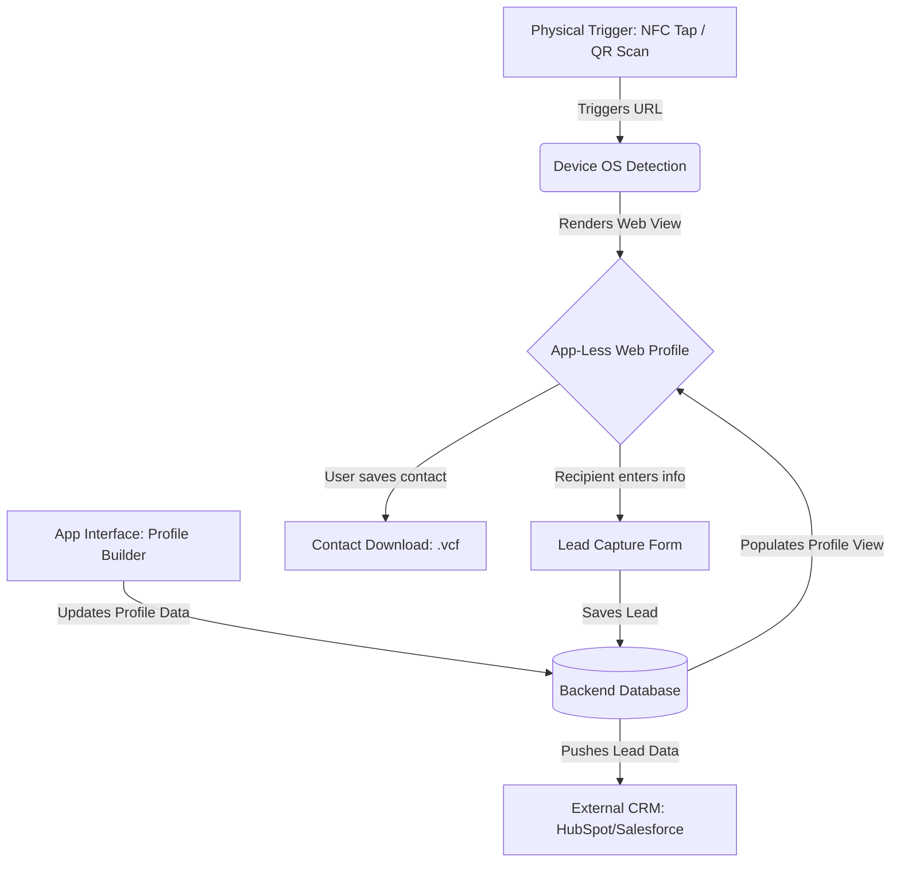

# 📇 CredenSync: The Open-Source Digital Business Card

CredenSync is a lightweight, self-hostable digital business card platform designed for frictionless networking. It combines NFC, QR codes, and a zero-friction mobile web experience to replace traditional paper business cards.

Built as a high-performance alternative to proprietary platforms like Mobilo and Popl, CredenSync gives individuals, freelancers, and businesses complete ownership of their data, profiles, and routing logic without enterprise lock-in.

## ✨ Core Features

* **⚡ Frictionless Exchange:** The recipient does not need an app. Tapping an NFC card or scanning a QR code instantly renders a lightning-fast web profile.

* **📱 Native VCF Generation:** One-tap "Save to Contacts" dynamically generates `.vcf` files based on the detecting operating system (iOS/Android).

* **🎨 Modular Profile Builder:** Drag-and-drop interface for users to build their landing page with contact info, social links, calendars, and rich media blocks.

* **🤝 Lead Capture Engine:** Built-in form for recipients to share their information back, creating a two-way networking exchange.

* **☁️ Bring Your Own Storage:** Fully S3-compatible object storage support. Designed for zero-egress providers like Cloudflare R2 or Backblaze B2.

## 🏗️ Architecture & Data Flow

When a networking event happens, speed is everything. CredenSync is architected to process the tap, detect the OS, and render the profile in milliseconds.



### 💻 The Tech Stack

* **Backend:** Go (Standard Library `net/http`). High concurrency, ultra-low memory footprint, and near-zero latency for tap routing.

* **Frontend:** Svelte 5 (Vite SPA) + shadcn-svelte. Compiles to tiny vanilla JavaScript for instantaneous mobile loading over cellular networks without the overhead of SSR.

* **Database:** PostgreSQL. Strict relational integrity for users, with `JSONB` support for dynamic profile blocks.

* **Storage:** Cloudflare R2 (Primary) / Backblaze B2 (Fallback) via AWS S3 SDK.

* **Deployment:** Multi-container Docker Compose (Nginx for static frontend serving).

## 🚀 Getting Started (Self-Hosting)

CredenSync is designed to be deployed in minutes using Docker Compose.

### 1. Clone the repository

```bash
git clone https://github.com/yourusername/credensync.git
cd credensync
```

### 2. Configure Environment Variables

Copy the example environment file and add your S3 credentials (Cloudflare R2, Backblaze B2, or local MinIO):

```bash
cp .env.example .env
```

*Example `.env`:*

```env
# Database
DB_USER=credensync_admin
DB_PASSWORD=your_secure_password
DB_NAME=credensync_db

# S3 Compatible Storage (e.g., Cloudflare R2)
S3_ENDPOINT=https://<ACCOUNT_ID>.r2.cloudflarestorage.com
S3_ACCESS_KEY_ID=your_access_key
S3_SECRET_ACCESS_KEY=your_secret_key
S3_BUCKET_NAME=credensync-assets
```

### 3. Spin up the containers

```bash
docker compose up -d
```

* The Svelte frontend is now available at `http://localhost:3000`

* The Go API is running at `http://localhost:8080`

* Postgres is running and safely abstracted behind the backend.

## 💳 Writing to Physical NFC Cards

CredenSync is hardware-agnostic. You can purchase any blank NTAG215 or NTAG216 PVC card from Amazon.

1. Generate your profile URL in the CredenSync dashboard (e.g., `https://yourdomain.com/p/faiz`).

2. Download a free NFC writer app (like NFC Tools) on iOS or Android.

3. Select "Write URI", paste your generated URL, and hold your phone to the blank card.

## 🤝 Contributing

We welcome contributions from the open-source community! Whether it is adding new profile blocks, expanding CRM integrations (HubSpot, Salesforce), or optimizing the Svelte UI, please submit a pull request.

Please ensure all Go code passes `gofmt` and Svelte components adhere to the existing `shadcn-svelte` design system.
