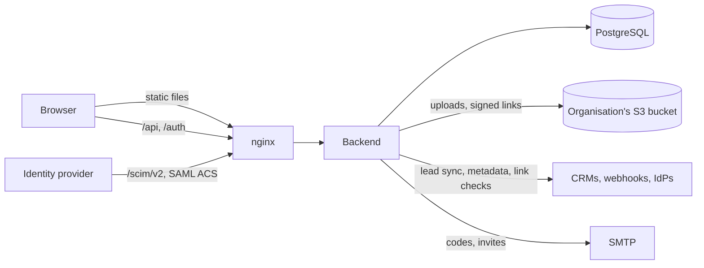

# Architecture

Fronko is two apps and a database:

- **backend/**: one Go binary. It serves the JSON API, the SAML and SCIM endpoints, and runs background jobs and periodic tasks.
- **frontend/**: a Svelte 5 single-page app, built to static files and served by nginx. nginx also proxies `/api/`, `/auth/` and `/scim/` to the backend, so the browser sees one origin.
- **PostgreSQL**: everything that persists, including the job queue. There is no Redis or message broker.



## Backend

### Layout

```
backend/
├── cmd/fronko/main.go     # subcommands: serve (default), admin, seed
├── internal/
│   ├── server/            # composition root: builds every module, runs HTTP + jobs + tasks
│   ├── app/               # the Module contract and route groups (Routes)
│   ├── platform/          # infrastructure with no business rules
│   │   ├── config/  database/  httpx/  mail/  secrets/  storage/
│   │   ├── netguard/      # SSRF-safe HTTP client for addresses users supply
│   │   ├── ratelimit/  web/ (CORS, same-origin check)
│   │   ├── events/        # in-process domain event bus
│   │   └── jobs/          # Postgres job queue, worker, periodic tasks
│   ├── auth/              # passwords, JWTs, email codes, session middleware, Principal, Scope
│   ├── users/  account/  orgs/  teams/  branding/  files/
│   ├── cards/  leads/  analytics/  feedback/  platformadmin/
│   ├── integrations/      # catalog, connections, OAuth, lead dispatch, activity
│   │   ├── providers/     # all.go (the registry list), comingsoon.go, webhook/, hubspot/, calendar/
│   │   ├── sso/           # SAML service provider, email domains, the SSO policy
│   │   └── directory/     # SCIM 2.0 server
│   ├── devseed/           # `fronko seed`: demo data for development
│   └── integrationtest/   # tests against a real database (build tag `integration`)
└── migrations/            # golang-migrate SQL files
```

### Modules

Each feature is a package that owns its handlers, its SQL (`store.go`) and its types. A module plugs into the server through the interfaces in [`internal/app/app.go`](../backend/internal/app/app.go):

```go
type Module interface     { Routes(r *app.Routes) }                     // required
type Subscriber interface { Subscribe(b *events.Bus) }                   // reacts to other modules' events
type Worker interface     { JobHandlers() map[string]jobs.Handler }      // runs background jobs
type Scheduled interface  { Tasks() []jobs.Task }                        // periodic work
```

[`internal/server/server.go`](../backend/internal/server/server.go) builds every store, service and module by hand, in one function, and then for each module calls `Routes` and checks for the optional interfaces. There is no DI framework and no `init()` registration, so the whole graph can be read top to bottom in one file.

**Dependency rules:**

- Modules import `platform/*` and `auth`, and nothing in `server`.
- A module uses another module through a small interface or function type, passed in at wiring time. For example, `integrations` takes a `LeadReader` (satisfied by `leads.Store`), and `cards` takes a `BookingFinder` function built from the integrations service, which returns an organisation's booking pages (`BookingPages`: the page a card may show, and the pages it can choose from).
- Importing another module's types is fine when there's no cycle (`integrations` imports `leads` for `leads.Created`). When there would be one, the interface goes on the consuming side.
- SQL stays in the module that owns the tables. Shared references (`auth.UserRef`, `auth.TeamRef`, roles) live in `auth`.
- `platform/*` packages never import a feature module.

[Backend modules](backend-modules.md) walks through adding one.

### Route groups

Modules don't build middleware chains. They register each route on the group that says who may call it, and [`app.Routes`](../backend/internal/app/routes.go) mounts it behind the right chain:

| Method | Who may call it | Chain |
| ------ | --------------- | ----- |
| `Public` | Anyone | same-origin check |
| `External` | Other servers with their own credentials (SCIM clients, an IdP posting to the ACS) | none: the handler authenticates the caller. Never acts on the session cookie alone |
| `SignedIn` | A session, even before the email is verified | session |
| `Verified` | A session with a verified email, even on a temporary password | session → verified |
| `User` | A session, a verified email and a password the user chose | session → verified → password set |
| `Admin`, `Owner` | `User`, plus the role | … → role check |
| `PlatformAdmin` | The platform admin panel (`/api/admin/*`) | admin cookie |

`User` routes must live under `/api/<area>/` (`/api/me/`, `/api/org/`, `/api/integrations/`): the first route in an area mounts the whole area behind the chain, so nothing in it can be reached without a session by mistake.

### Request pipeline

```
Request
 ├─ External routes (/scim/v2/*, POST /auth/saml/{id}/acs)  → rate limit → handler (own auth)
 └─ CORS → SameOrigin → ServeMux
      ├─ Public routes                     → [rate limit] → handler
      ├─ SignedIn / Verified routes        → JWTMiddleware → [RequireVerified] → handler
      ├─ /api/<area>/*                     → JWTMiddleware → RequireVerified → RequirePasswordSet
      │                                        → [RequireAdmin | RequireOwner] → handler
      └─ /api/admin/*                      → AdminMiddleware → handler
```

`JWTMiddleware` loads the session state on every request (session version, verification, role, suspension, teams), so revoking a session or suspending someone takes effect at once. Handlers read the caller with `auth.PrincipalFrom(ctx)` and limit queries with `auth.ScopeOf(r)`.

### Events

[`platform/events`](../backend/internal/platform/events/events.go) is a synchronous, typed, in-process bus. An event is a plain struct named in the past tense and defined by the module that publishes it (`leads.Created`).

```go
events.Subscribe(bus, func(ctx context.Context, q database.Querier, e leads.Created) error { … })
bus.Publish(ctx, tx, leads.Created{…})
```

`Publish` runs every subscriber with the publisher's database handle, which is normally the transaction that made the change. A subscriber that queues a job does so in that same transaction, so the change and its follow-up work commit together or not at all. That gives a transactional outbox without an outbox table. Subscribers must be quick and must not call other services; anything slow or fallible goes into a job.

### Jobs and periodic tasks

[`platform/jobs`](../backend/internal/platform/jobs/jobs.go) is a queue in the `jobs` table:

- **Queueing.** `jobs.Enqueue(ctx, q, kind, payload, opts)`, usually inside the transaction that caused it. `DedupeKey` makes it a no-op while a job of the same kind and key is still queued or running. The insert also sends `NOTIFY fronko_jobs`, delivered only if the transaction commits.
- **Running.** Each backend runs `JOB_WORKERS` goroutines (default 2; `0` queues without running). Workers claim due jobs with `FOR UPDATE SKIP LOCKED`, so any number of instances share the queue safely. They wake on `LISTEN` and poll every few seconds as a fallback.
- **Retries.** A handler error retries the job with exponential backoff and jitter (about 30 s, 1 m, 2 m … capped at 6 h), up to 10 attempts (about four hours). An error wrapped in `jobs.Permanent` marks the job dead at once.
- **At least once.** A job whose worker died is reclaimed after a 10-minute lease and run again, so handlers must be idempotent. Each run has a 5-minute timeout.
- **Clean-up.** Finished and dead jobs are deleted after 30 days.

Job kinds are prefixed with the module's name (`integrations.push_lead`).

**Periodic tasks** (`jobs.Task{Name, Every, Run}`) run once at start-up and then on their interval. Each run holds a Postgres advisory lock named after the task, so with several instances only one runs it at a time. Tasks today: the hourly usage snapshot, analytics retention, integration activity retention (90 days), reclaiming abandoned jobs and deleting old ones.

### The lead sync path, end to end

```mermaid
sequenceDiagram
    participant V as Visitor
    participant L as leads
    participant DB as Postgres
    participant I as integrations
    participant W as Job worker
    participant P as Provider (webhook, HubSpot)

    V->>L: POST /api/profiles/{id}/leads
    L->>DB: BEGIN; INSERT lead
    L->>I: Publish leads.Created (same tx)
    I->>DB: INSERT one integrations.push_lead job per lead sync connection
    L->>DB: COMMIT (NOTIFY wakes a worker)
    W->>DB: claim job (SKIP LOCKED)
    W->>I: pushLead(job)
    I->>P: PushLead(lead)
    P-->>I: Result or error
    I->>DB: activity entry; success, retry or mark failure
```

### Data ownership

Every row belongs to an organisation (`org_id`), and queries always filter by it. Members see a narrower slice through `auth.Scope` and the `visibleTo()` SQL helper: their own cards and leads, plus their teammates' for team leads. Integrations follow the same rule: organisation connections belong to admins, personal ones to the person who made them.

## Frontend

The frontend is a static SvelteKit app (`ssr = false`). The code is grouped by feature:

```
src/lib/
├── core/                 # api client, session, theme, formatting, confirm and unsaved-changes helpers, nav.ts and settings-tabs.ts registries
├── components/ui/        # shadcn-svelte primitives (generated)
├── components/shared/    # components used across features (sidebar, page header, load error, confirm dialog, charts, pickers, form layout)
└── features/<feature>/   # api.ts, types, stores (*.svelte.ts), helpers and components/
```

Routes under `src/routes/` stay thin and compose feature components. See [Frontend structure](frontend-structure.md) for the rules and the registries.

The integrations UI is driven entirely by the backend's catalog: each provider's manifest lists its fields, and the generic form renders them. Adding a provider needs no frontend code beyond, optionally, a logo in `features/integrations/registry.ts`.
