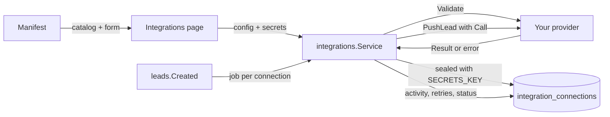

# Writing an integration provider

A provider is one outside service. Adding one is a new folder under `backend/internal/integrations/providers/` and one line in `providers/all.go`. The catalog, the settings form, secret storage, OAuth, lead dispatch, retries, the activity log and the Test button all come from the core.

This guide follows the [webhook provider](../../backend/internal/integrations/providers/webhook/webhook.go), the simplest complete one, then shows what changes for OAuth and the other capabilities. Read the [integrations overview](overview.md) first for how connections behave.

## How it fits together



The core finds out what a provider can do by type assertion on optional interfaces:

| Interface | Method | What it enables |
| --------- | ------ | --------------- |
| `Provider` (required) | `Manifest()`, `Validate(ctx, Settings)` | Listing it and saving connections |
| `LeadPusher` | `PushLead(ctx, *Call, *Lead) (Result, error)` | Lead sync: one call per lead, plus **Send test lead** |
| `Tester` | `Test(ctx, *Call) (Result, error)` | A **Test** button for providers that don't push leads |
| `OAuthProvider` | `OAuth(Settings) OAuthSpec` | **Authorise** with the organisation's own OAuth app |
| `BookingLinker` | `Booking(Settings) *Booking` | A card's "Book a meeting" button |
| `Initializer` | `Init(ctx, *Settings) error` | Preparing a new connection (SAML makes a key pair here) |
| `Describer` | `Endpoints(*Connection, Env) []Endpoint` | Values to copy into the provider (callback URLs, SCIM base URL) |

All of these are in [`integrations/provider.go`](../../backend/internal/integrations/provider.go).

## 1. The manifest

The manifest is the single source of truth: the catalog tile, the settings form and the server-side validation are all built from it.

```go
func New() *Provider {
	return &Provider{M: integrations.Manifest{
		ID:          "webhook",                      // stable, stored on connections: a-z, 0-9, dashes
		Name:        "Webhook",
		Category:    integrations.CategoryLeadSync,  // lead_sync, calendar, directory or sso
		Description: "Send each new lead as JSON to any URL …",
		Scopes:      []integrations.Scope{integrations.ScopeOrg, integrations.ScopeUser}, // first is the default
		Auth:        integrations.AuthNone,          // none, api_key, oauth2, link, saml, scim_token
		Status:      integrations.Available,         // available, beta, coming_soon
		Multiple:    true,                           // more than one connection per owner
		Fields: []integrations.Field{
			{Key: "url", Label: "Payload URL", Type: integrations.FieldURL, Required: true,
				Placeholder: "https://example.com/hooks/fronko", Help: "…"},
			{Key: "signing_secret", Label: "Signing secret", Type: integrations.FieldSecret, Generate: true, Help: "…"},
		},
		SetupSteps: []string{"…", "…"},
		DocsURL:    "https://github.com/faiz-gh/fronko/blob/master/docs/integrations/webhook-zapier.md",
		Requires:   []integrations.Requirement{integrations.RequiresSecretsKey},
		Keywords:   []string{"zapier", "make", "n8n", "http", "api", "json"},
	}}
}
```

**Fields.** Types are `text`, `url`, `secret`, `select` (with `Options`), `textarea` and `bool`. The core enforces `Required`, the type and length limits before your `Validate` runs:

- `url` fields must be absolute `https` URLs on public hosts (in development, `http` and private hosts are allowed).
- `secret` fields are sealed with `SECRETS_KEY`, never sent back to the browser, and kept when the form leaves them blank. `Generate: true` adds a button that makes a random value (for secrets both sides need to know).
- `Default` fills a new form. `MaxLength` raises the limit for long values such as SAML metadata XML.
- Keys are `snake_case` and must be unique.

**Requirements.** List `RequiresPublicURL` if the provider needs callback URLs, and `RequiresSecretsKey` if it stores secrets. (OAuth providers and anything with a `secret` field need `SECRETS_KEY` anyway.) The catalog shows the provider as unavailable, with the reason, until the server has them.

**Categories with one connection.** Calendar, directory and SSO allow one connection per owner across the whole category; you don't need `Multiple` for those. For lead sync, `Multiple: false` limits it to one connection per owner for your provider (HubSpot does this).

`Register` checks the manifest at start-up and panics on mistakes (bad id, unknown type, a select with no options, an OAuth provider without `client_id`/`client_secret`), so a broken manifest never ships.

## 2. Validate

`Validate` checks what the field rules can't. Return `integrations.NewFieldError(key, message)` to point the form at a field:

```go
// The webhook needs nothing beyond the field checks.
func (p *Provider) Validate(context.Context, integrations.Settings) error { return nil }

// The Zapier preset checks the host.
func (p *preset) Validate(_ context.Context, cfg integrations.Settings) error {
	u, _ := url.Parse(cfg.String("url"))
	if !strings.HasSuffix(strings.ToLower(u.Hostname()), "hooks.zapier.com") {
		return integrations.NewFieldError("url", "this doesn't look like a Zapier webhook URL (hooks.zapier.com)")
	}
	return nil
}
```

Messages go to people as they are: write them as sentences a user can act on. Don't call the provider from `Validate`; that's what **Test** is for.

## 3. Do the work

```go
func (p *Provider) PushLead(ctx context.Context, call *integrations.Call, lead *integrations.Lead) (integrations.Result, error) {
	delivery := fmt.Sprintf("lead-%d-%d", lead.ID, call.Connection.ID)
	if lead.ID == 0 { // Send test lead
		delivery = "test-" + strings.ToLower(rand.Text()[:12])
	}
	…
	req.Header.Set("X-Fronko-Delivery", delivery)
	if secret := call.Settings.Secrets["signing_secret"]; secret != "" {
		req.Header.Set("X-Fronko-Signature", Sign(secret, p.now(), body))
	}
	resp, err := call.HTTP.Do(req)
	…
}
```

What you get in `Call`:

- `call.Settings.Values` and `call.Settings.Secrets`: the connection's settings, secrets decrypted. Use `Settings.String(key)` and `Settings.Bool(key)`.
- `call.HTTP`: the client to use for every request. It refuses private and local addresses (outside development), doesn't follow redirects, ignores proxy variables and times out after 20 seconds. **For OAuth providers it also adds the access token and refreshes it**, saving the new token. Never use `http.DefaultClient`.
- `call.Connection`: the connection (its id, scope, name).
- `call.PublicURL`: the site's address (`PUBLIC_URL`, else the first `FRONTEND_URL`), or `""`.

What you get in `Lead`: version 1 of the lead payload (id, time, name, email, E.164 phone, notes, source, the card with its link, the card holder, the organisation). It's the same shape the webhook sends; add fields there rather than in a provider, and never rename or remove one. A test lead has `ID == 0`.

**Return values.**

- On success, a `Result{Summary, Detail}`. `Summary` is one line for the activity log ("Created contact ada@example.com"); `Detail` is what someone troubleshooting would want (HTTP status, remote id).
- On failure, an error. **Plain errors are retried** (about 30 s, 1 m, 2 m … up to 10 attempts). Wrap ones that retrying can't fix in `jobs.Permanent(err)`: bad credentials, a rejected payload, a missing scope. Attach details for the log with `integrations.WithDetail(err, map[string]any{"status": 422, "response": "…"})`.
- Error messages are shown in the activity log and on the connection, so write them for people: "HubSpot refused the authorisation; authorise the connection again", not "401".

**Idempotency.** Deliveries are at least once, so a lead can arrive twice. Upsert on the remote side (HubSpot matches on email) or send an id the receiver can deduplicate on (the webhook's `X-Fronko-Delivery`).

**Sorting HTTP statuses.** The webhook's rule is a good default: `2xx` success; `408`, `429` and `5xx` retry; `3xx` and other `4xx` permanent. `401` and `403` are usually permanent with a message telling people what to fix.

## 4. Register it

Add one line to [`providers/all.go`](../../backend/internal/integrations/providers/all.go), in the category's block, in the order the catalog should show it:

```go
// Lead Sync
r.Register(webhook.New())
…
r.Register(acmecrm.New())
```

If the provider was listed as coming soon, delete its entry from `comingsoon.go`: an id can only be registered once.

Providers that serve their own HTTP routes (SAML's ACS, the SCIM server) live beside the core, in `integrations/sso` and `integrations/directory`, and are wired as modules in `server.go`. A provider that only calls out never needs that.

## 5. Logo (optional)

Add an entry to `LOGOS` in [`frontend/src/lib/features/integrations/registry.ts`](../../frontend/src/lib/features/integrations/registry.ts): a [simple-icons](https://simpleicons.org/) glyph (`glyph(siAcme)`), a Lucide icon, or just a brand colour. Without one, the tile shows the provider's initials. That's the only frontend change: the form is built from the manifest.

## 6. Tests

Test the provider with `httptest`. The webhook tests are a good template:

```go
srv := httptest.NewServer(http.HandlerFunc(func(w http.ResponseWriter, r *http.Request) { … }))
call := &integrations.Call{
	Connection: &integrations.Connection{ID: 9},
	Settings: integrations.Settings{
		Values:       map[string]any{"url": srv.URL},
		Secrets:      map[string]string{"signing_secret": "s3cret"},
		AllowPrivate: true, // httptest listens on localhost
	},
	HTTP: netguard.Client(netguard.Options{AllowPrivate: true}),
}
res, err := p.PushLead(ctx, call, lead)
```

Cover at least: the request you send (path, headers, body), success, a retryable failure (not `jobs.IsPermanent`), a permanent one (`jobs.IsPermanent`), and `Validate`'s field errors. Give the provider struct its base URLs as fields (as `hubspot.Provider` does) so tests can point it at a test server. `providers/all_test.go` checks every manifest registers.

## 7. Docs

- Write `docs/integrations/<id>.md`: who can connect it, what the server needs, setup steps with exact menu names, what data goes where, and a troubleshooting table of the messages your provider returns. Point the manifest's `DocsURL` at it.
- Add it to the table in [overview.md](overview.md) and the [docs index](../README.md).

## OAuth providers

Each organisation registers its own OAuth app with the provider ([ADR 0004](../adr/0004-per-organisation-oauth-apps.md)), so OAuth providers need:

```go
Auth: integrations.AuthOAuth2,
Fields: []integrations.Field{
	{Key: "client_id", Label: "Client ID", Type: integrations.FieldText, Required: true},
	{Key: "client_secret", Label: "Client secret", Type: integrations.FieldSecret, Required: true},
	…
},
Requires: []integrations.Requirement{integrations.RequiresPublicURL, integrations.RequiresSecretsKey},
```

and an `OAuth` method:

```go
func (p *Provider) OAuth(integrations.Settings) integrations.OAuthSpec {
	return integrations.OAuthSpec{
		AuthURL:   p.AuthURL,
		TokenURL:  p.TokenURL,
		Scopes:    []string{"crm.objects.contacts.write"},
		AuthStyle: oauth2.AuthStyleInParams, // how the client secret goes to TokenURL
		PKCE:      false,                    // true if the provider supports it
	}
}
```

The core does the rest:

1. **Authorise** opens `/api/integrations/connections/{id}/oauth/start`, which redirects to `AuthURL` with an HMAC-signed `state` naming the connection and user, plus a short-lived cookie holding a nonce (and the PKCE verifier).
2. The provider returns to `/api/integrations/oauth/callback` on the API's address (`PUBLIC_API_URL`, which defaults to `PUBLIC_URL`), where the session and OAuth cookies are. Fronko checks the state, the user and the nonce, exchanges the code with the connection's own client ID and secret, and seals the token with the connection's secrets.
3. `call.HTTP` signs every request with the token, and refreshes and re-saves it when it expires. A refresh that fails with `invalid_grant` becomes a permanent error asking people to authorise again.

The connection stays **Setup incomplete** until it has a token. Changing the client ID or secret drops the token. The page shows the redirect URL to register in the provider's app. See [`hubspot.go`](../../backend/internal/integrations/providers/hubspot/hubspot.go) for a complete example.

## Other capabilities

- **`Tester`** for providers that don't push leads. Calendar providers open the booking page; SAML fetches the metadata. Return a `Result` on success or an error explaining what's wrong.
- **`BookingLinker`** returns the button a card shows. The core picks the card holder's connection, or the organisation's ([`calendar.go`](../../backend/internal/integrations/providers/calendar/calendar.go)).
- **`Initializer`** runs once before a connection is first saved. It may add internal secrets that aren't manifest fields; they're sealed with the rest and never shown.
- **`Describer`** returns values people copy into the provider (ACS URL, tenant URL). Build addresses other servers call or post to on `Env.APIURL`, and pages people open on `Env.PublicURL`; they differ when the API has its own domain. They're shown on the connection's page.

## Checklist

- [ ] `providers/<id>/` with the provider and its tests
- [ ] Manifest: clear description, setup steps with exact menu names, `DocsURL`, `Requires`, keywords
- [ ] Errors sorted into retryable and `jobs.Permanent`, with messages people can act on
- [ ] One line in `providers/all.go`; placeholder removed from `comingsoon.go`
- [ ] Logo in `registry.ts` (optional)
- [ ] `docs/integrations/<id>.md`, listed in the overview and the docs index
- [ ] `make test`, `make lint` and `npm test` pass
